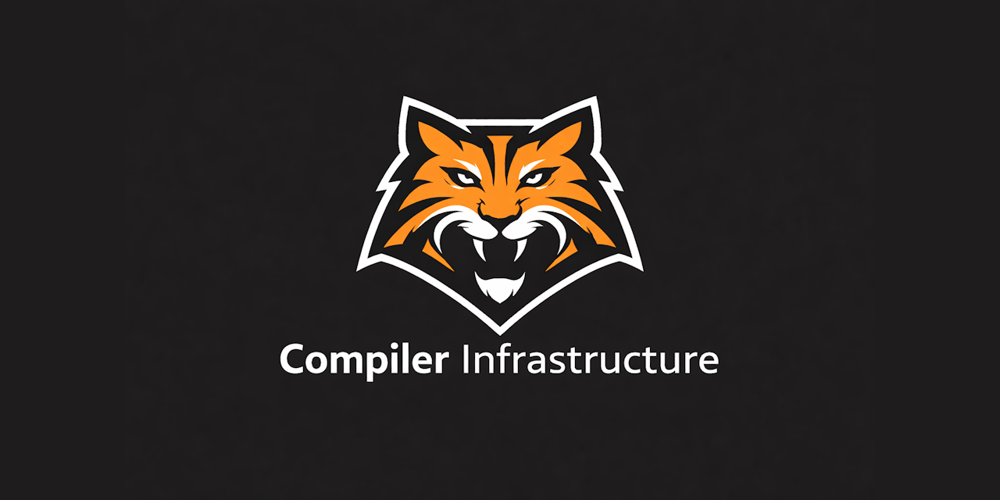

<div align="center">



[](https://discord.gg/Wb6z8Wam7p) [](https://bsky.app/profile/tinybiggames.com)

A programmatic compiler infrastructure for building native x86-64 Windows binaries from Delphi.

</div>

## What is Tiger?

**Tiger** is a Delphi-hosted compiler infrastructure that lets you programmatically generate native x86-64 Windows binaries — executables, DLLs, static libraries, and COFF object files — entirely from code. There is no source language to parse. Instead, you construct programs using a fluent Delphi API: define types, declare functions, emit statements and expressions, and call `Build`. Tiger handles SSA-based IR generation, optimization, machine code emission, PE linking, and resource embedding.

```delphi
LTiger := TTiger.Create();
try
  LTiger.ImportDll('msvcrt.dll', 'printf', [vtPointer], vtInt32, True);
  LTiger.ImportDll('kernel32.dll', 'ExitProcess', [vtUInt32], vtVoid);

  LTiger.BeginFunc('main', vtVoid, True)
    .Call('printf', [LTiger.Str('Hello, World!'#10)])
    .Call('ExitProcess', [LTiger.Int(0)])
  .EndFunc();

  LTiger.TargetExe('output\hello.exe', ssConsole);
  LTiger.Build(True, nil);
finally
  LTiger.Free();
end;
```

## 🎯 Who is Tiger For?

Tiger is designed for Delphi developers who need to generate native machine code at build time or runtime. If you're building any of the following, Tiger gives you a pure-Delphi path to native x86-64 binaries without external compilers, linkers, or toolchains:

- **Custom language compilers** — Build your own programming language and target real Windows executables. Tiger handles the backend so you can focus on parsing and semantics.
- **Scripting engines with native compilation** — Compile user scripts or DSLs down to machine code instead of interpreting them, getting native performance with no runtime overhead.
- **JIT compilation** — Generate and execute native code on the fly for performance-critical paths in your application (run-from-memory support coming in v0.2.0).
- **Game scripting systems** — Let modders or designers write game logic in a custom language that compiles to native code through Tiger.
- **Rule engines and formula evaluators** — Compile business rules, mathematical formulas, or filter expressions into native functions that execute at full CPU speed.
- **Plugin and extension systems** — Generate native DLLs programmatically so your application can produce its own loadable plugins.
- **Compiler education** — Learn how compilers work in a language you already know. Tiger's source is pure Object Pascal — no C++ template metaprogramming or LLVM API to wrestle with.

Tiger requires only a single `uses Tiger;` clause. There are no external dependencies, no C/C++ toolchain, and no LLVM installation. Everything from IR construction through PE linking happens inside your Delphi process.

## ✨ Key Features

- 🔧 **Programmatic API** — Build native binaries entirely from Delphi code, no parser needed
- ⚡ **Fluent interface** — Chainable method calls for clean, readable program construction
- 🎯 **Native x86-64** — Generates real machine code, not bytecode or interpreted output
- 🔗 **DLL imports** — Call any Windows API or third-party DLL function directly
- 📦 **Static linking** — Produce and consume `.lib` and `.obj` COFF files
- 🎛️ **Multiple outputs** — Build executables, DLLs, static libraries, or object files
- 🧬 **Rich type system** — Records, unions, arrays, enums, sets, pointers, and function pointer types
- 🔀 **Record inheritance** — Extend records with base type fields and correct ABI layout
- 🔀 **Union types** — C-compatible unions with anonymous nesting inside records
- 📊 **Fixed and dynamic arrays** — Compile-time sized arrays and runtime-managed dynamic arrays
- 🔢 **Set types** — Pascal-style sets with membership, union, intersection, and difference operations
- 🧠 **SSA optimizer** — Constant folding, copy propagation, common subexpression elimination, dead code elimination
- ⚠️ **Exception handling** — try/except/finally with Windows SEH and hardware exception support
- 🔌 **Variadic functions** — Native Tiger varargs with `VaCount_` and `VaArgAt_` intrinsics
- 🔄 **Function overloading** — Multiple functions with the same name resolved by parameter signature
- 🏷️ **Version info** — Embed metadata and icons in executables
- 📝 **Managed strings** — Reference-counted string types with concatenation and lifecycle management
- 💾 **Runtime memory** — Built-in `Tiger_GetMem`/`Tiger_FreeMem` heap management

## 🚀 Getting Started

Every Tiger program follows the same workflow: create, configure, define, build. Here's a complete example that produces a working console executable:

```delphi
uses
  Tiger;

procedure BuildMyProgram();
var
  LTiger: TTiger;
begin
  LTiger := TTiger.Create();
  try
    // 1. Configure: set optimization level and status output
    LTiger.SetOptimizationLevel(2);
    LTiger.SetStatusCallback(
      procedure(const AText: string; const AUserData: Pointer)
      begin
        WriteLn(AText);
      end, nil);

    // 2. Import external functions your program needs
    LTiger.ImportDll('msvcrt.dll', 'printf', [vtPointer], vtInt32, True);
    LTiger.ImportDll('kernel32.dll', 'ExitProcess', [vtUInt32], vtVoid);

    // 3. Define types (optional — only if you need records, arrays, etc.)
    LTiger.DefineRecord('TPoint')
         .Field('X', vtInt32)
         .Field('Y', vtInt32)
       .EndRecord();

    // 4. Write functions using the fluent API
    LTiger.BeginFunc('main', vtVoid, True)
       .Local('pt', 'TPoint')
       .AssignField('pt', 'X', LTiger.Int(10))
       .AssignField('pt', 'Y', LTiger.Int(20))
       .Call('printf', [LTiger.Str('Point: (%d, %d)'#10),
         LTiger.FieldExpr(LTiger.Var_('pt'), 'X'),
         LTiger.FieldExpr(LTiger.Var_('pt'), 'Y')])
       .Call('ExitProcess', [LTiger.Int(0)])
    .EndFunc();

    // 5. Set the target and build
    LTiger.TargetExe('output\myprogram.exe', ssConsole);
    if not LTiger.Build(True, nil) then
      WriteLn(LTiger.GetErrorText());

  finally
    LTiger.Free();
  end;
end;
```

The `src\testbed` project contains extensive working examples covering every feature documented below. It is the best reference for learning the API.

> **IDE Documentation:** The `TTiger` class in `Tiger.pas` includes comprehensive XML documentation on every public method. In the Delphi IDE, hover over any method or press Ctrl+Shift+D to see detailed parameter descriptions, usage notes, and cross-references.

## 📘 API Overview

### Built-in Types

Tiger uses explicit, fixed-size types with no implicit conversions. Every type has a known size, making memory layout predictable and C ABI compatible.

| Type | Size | Description |
|------|------|-------------|
| `vtInt8`, `vtInt16`, `vtInt32`, `vtInt64` | 1–8 bytes | Signed integers |
| `vtUInt8`, `vtUInt16`, `vtUInt32`, `vtUInt64` | 1–8 bytes | Unsigned integers |
| `vtFloat32`, `vtFloat64` | 4–8 bytes | IEEE 754 floating point |
| `vtPointer` | 8 bytes | Untyped pointer (64-bit) |
| `vtVoid` | — | Procedure return type only |

### Output Types

Every Tiger program targets one output format. The target method determines what the backend produces.

| Method | Description |
|--------|-------------|
| `TargetExe(path, subsystem)` | PE executable (console or GUI) |
| `TargetDll(path)` | Dynamic link library |
| `TargetLib(path)` | Static library (COFF `.lib`) |
| `TargetObj(path)` | Relocatable object file (COFF `.obj`) |

### Linkage Modes

Tiger supports two calling convention / name-mangling modes for interoperability with external code.

| Linkage | Description |
|---------|-------------|
| `plDefault` | C++ Itanium mangling (default) |
| `plC` | C linkage, no name mangling |

## 🔗 DLL Imports

Any function exported from a Windows DLL can be imported into a Tiger program using `ImportDll`. Tiger writes the import into the PE import table, and the Windows loader resolves it at startup. This is how Tiger programs access the Windows API, the C runtime, and any third-party DLL.

```delphi
// Import printf with variadic arguments
LTiger.ImportDll('msvcrt.dll', 'printf', [vtPointer], vtInt32, True);

// Import ExitProcess from kernel32
LTiger.ImportDll('kernel32.dll', 'ExitProcess', [vtUInt32], vtVoid);

// Import GetSystemMetrics from user32
LTiger.ImportDll('user32.dll', 'GetSystemMetrics', [vtInt32], vtInt32);

// Import MessageBoxA with specific linkage
LTiger.ImportDll('user32.dll', 'MessageBoxA',
  [vtUInt64, vtPointer, vtPointer, vtUInt32], vtInt32);
```

### Dynamic Loading

For functions that may not be available on all systems, or when you need to choose a DLL at runtime, use `LoadLibraryA` and `GetProcAddress` through standard kernel32 imports. This gives you runtime control over which libraries are loaded and lets you handle missing functions gracefully.

```delphi
LTiger.ImportDll('kernel32.dll', 'LoadLibraryA', [vtPointer], vtPointer);
LTiger.ImportDll('kernel32.dll', 'GetProcAddress', [vtPointer, vtPointer], vtPointer);

LTiger.BeginFunc('main', vtVoid, True)
   .Local('hUser32', vtPointer)
   .Local('pFunc', vtPointer)
   .Assign('hUser32', LTiger.CallExpr('LoadLibraryA', [LTiger.Str('user32.dll')]))
   .Assign('pFunc', LTiger.CallExpr('GetProcAddress',
     [LTiger.Var_('hUser32'), LTiger.Str('GetSystemMetrics')]))
   .Call('ExitProcess', [LTiger.Int(42)])
.EndFunc();
```

## 📦 Static Linking

Tiger can produce COFF static libraries (`.lib`) and object files (`.obj`), and link against them in subsequent builds. This lets you split large projects into separately compiled modules, distribute precompiled libraries, or interoperate with object files produced by other toolchains that emit standard COFF.

### Building a Static Library

Compile functions into a `.lib` file by setting the target to `TargetLib`. Functions intended for external use should use C linkage (`plC`) and be marked as public (`True` for the export parameter).

```delphi
// Build a .lib with exported functions
LTiger.BeginFunc('AddC', vtInt32, False, plC, True)
   .Param('a', vtInt32)
   .Param('b', vtInt32)
   .Return(LTiger.Add(LTiger.Var_('a'), LTiger.Var_('b')))
.EndFunc();

LTiger.BeginFunc('MulC', vtInt32, False, plC, True)
   .Param('a', vtInt32)
   .Param('b', vtInt32)
   .Return(LTiger.Mul(LTiger.Var_('a'), LTiger.Var_('b')))
.EndFunc();

LTiger.TargetLib('output\MyLib.lib');
LTiger.Build(False, nil);
```

### Consuming a Static Library

Import functions from a static library using `ImportLib` and tell Tiger where to find the `.lib` file using `AddLibPath`. The linker reads the COFF archive, resolves symbols, and merges the referenced object code directly into your executable.

```delphi
LTiger.ImportLib('MyLib', 'AddC', [vtInt32, vtInt32], vtInt32, False, plC);
LTiger.ImportLib('MyLib', 'MulC', [vtInt32, vtInt32], vtInt32, False, plC);
LTiger.AddLibPath('output');

LTiger.BeginFunc('main', vtVoid, True)
   .Local('r1', vtInt32)
   .Assign('r1', LTiger.CallExpr('AddC', [LTiger.Int(3), LTiger.Int(4)]))
   .Call('printf', [LTiger.Str('AddC(3, 4) = %d'#10), LTiger.Var_('r1')])
   .Call('ExitProcess', [LTiger.Int(0)])
.EndFunc();
```

## 📝 Console Output

Tiger programs typically use `printf` from `msvcrt.dll` for formatted output. Import it once with the variadic flag set to `True`, then call it with standard C format strings. The Tiger runtime automatically sets the console code page to UTF-8 (65001) at startup when the runtime is included.

```delphi
LTiger.ImportDll('msvcrt.dll', 'printf', [vtPointer], vtInt32, True);

LTiger.BeginFunc('main', vtVoid, True)
   .Call('printf', [LTiger.Str('Hello from Tiger!'#10)])
   .Call('printf', [LTiger.Str('Integer: %d'#10), LTiger.Int32(42)])
   .Call('Tiger_Halt', [LTiger.Int(0)])
.EndFunc();
```

## 🔧 Expressions

All computation in Tiger is expressed through typed expression handles (`TTigerExpr`). Literal constructors produce leaf expressions, and operators combine them into trees. The resulting expression handles are passed to statements like `Assign`, `Return`, and `Call`.

### Literals

| Method | Description |
|--------|-------------|
| `Str(value)` | ANSI string literal |
| `WStr(value)` | Wide string literal |
| `Int(value)` | 64-bit integer |
| `Int32(value)` | 32-bit integer |
| `Int64_(value)` | 64-bit integer (explicit) |
| `Flt(value)` | 64-bit float |
| `Bool(value)` | Boolean |
| `Nil_()` | Null pointer |

### Arithmetic and Comparison

All arithmetic operates on 64-bit values. Integer operations produce `Int64` results; floating-point operations produce `Float64`. Comparison operators return an integer value of 1 (true) or 0 (false), suitable for use with `IfBegin`, `WhileBegin`, and other control flow constructs.

| Method | Description |
|--------|-------------|
| `Add(a, b)` | Addition |
| `Sub(a, b)` | Subtraction |
| `Mul(a, b)` | Multiplication |
| `Div_(a, b)` | Integer division |
| `Mod_(a, b)` | Modulo |
| `Neg(a)` | Negation |
| `CmpEq(a, b)` | Equal |
| `CmpNe(a, b)` | Not equal |
| `CmpLt(a, b)` | Less than |
| `CmpLe(a, b)` | Less or equal |
| `CmpGt(a, b)` | Greater than |
| `CmpGe(a, b)` | Greater or equal |

### Bitwise and Logical

Bitwise operations work on the raw bit patterns of integer values. Logical operators (`And_`, `Or_`, `Not_`) implement short-circuit evaluation — the second operand is not evaluated if the first operand determines the result.

| Method | Description |
|--------|-------------|
| `BitAnd(a, b)` | Bitwise AND |
| `BitOr(a, b)` | Bitwise OR |
| `BitXor(a, b)` | Bitwise XOR |
| `BitNot(a)` | Bitwise NOT |
| `Shl_(a, b)` | Shift left |
| `Shr_(a, b)` | Shift right |
| `And_(a, b)` | Logical AND (short-circuit) |
| `Or_(a, b)` | Logical OR (short-circuit) |
| `Not_(a)` | Logical NOT |

## 📦 Type Definitions

Tiger includes a complete type system for structured data: records with C ABI layout, unions, enumerations, arrays, sets, and pointers. Types are defined before any functions that use them, and their memory layout is computed at definition time so that `SizeOf_`, `AlignOf_`, and field offsets are available as compile-time constants.

### Records

Records define structured types with named fields. They follow C ABI alignment and padding rules, so a Tiger record with the same fields as a C struct will have identical memory layout. This makes it safe to pass Tiger records to Windows API functions and C libraries that expect specific struct layouts.

```delphi
// Simple record: TPoint (8 bytes, align 4)
LTiger.DefineRecord('TPoint')
     .Field('X', vtInt32)
     .Field('Y', vtInt32)
   .EndRecord();

// Nested record: TRect contains two TPoints
LTiger.DefineRecord('TRect')
     .Field('TopLeft', 'TPoint')
     .Field('BottomRight', 'TPoint')
   .EndRecord();

// Record with mixed-size fields (padding applied)
LTiger.DefineRecord('TStudent')
     .Field('NamePtr', vtPointer)
     .Field('Age', vtUInt8)
     .Field('Grade', vtFloat64)
   .EndRecord();
```

### Packed Records and Alignment

Use the `IsPacked` parameter to eliminate padding, or `ExplicitAlign` to force a specific alignment.

```delphi
// Packed: no padding between fields
LTiger.DefineRecord('TPackedPoint', True)
     .Field('X', vtInt32)
     .Field('Y', vtInt32)
   .EndRecord();

// Explicit alignment: force 16-byte alignment
LTiger.DefineRecord('TAlign16', False, 16)
     .Field('A', vtInt32)
     .Field('B', vtInt32)
   .EndRecord();
```

### Record Inheritance

Records can extend a base record. The derived record inherits all fields from the parent, preserving correct ABI offsets. This gives you simple single-inheritance for data types without the overhead of a VMT or RTTI — the derived record is just a larger struct that starts with the base record's fields.

```delphi
LTiger.DefineRecord('TPoint2D')
     .Field('X', vtInt32)
     .Field('Y', vtInt32)
   .EndRecord();

// TPoint3D inherits X, Y from TPoint2D, adds Z
LTiger.DefineRecord('TPoint3D', False, 0, 'TPoint2D')
     .Field('Z', vtInt32)
   .EndRecord();

// TPoint4D inherits X, Y, Z from TPoint3D, adds W
LTiger.DefineRecord('TPoint4D', False, 0, 'TPoint3D')
     .Field('W', vtInt32)
   .EndRecord();
```

### Union Types

Unions overlay all fields at the same memory offset. The union's size equals the size of its largest member. This is the same layout as a C `union` and is useful for type-punning, variant data, and interfacing with APIs that use discriminated unions.

```delphi
LTiger.DefineUnion('TVariant')
     .Field('AsInt', vtInt64)
     .Field('AsFloat', vtFloat64)
     .Field('AsPtr', vtPointer)
   .EndUnion();
```

### Anonymous Unions in Records

Embed anonymous unions directly inside records for variant-style layouts. The union fields share the same offset within the record, while non-union fields before and after occupy their own positions. This mirrors the C pattern of an anonymous union inside a struct.

```delphi
LTiger.DefineRecord('TPacket')
     .Field('Header', vtUInt32)
     .BeginUnion()
       .Field('IntPayload', vtInt64)
       .Field('FloatPayload', vtFloat64)
     .EndUnion()
     .Field('Checksum', vtUInt32)
   .EndRecord();
```

### Anonymous Records in Unions

Embed anonymous records inside unions for split-value patterns. This lets you access the same memory as either a single large value or a group of smaller named fields.

```delphi
LTiger.DefineUnion('TSplitValue')
     .Field('AsInt64', vtInt64)
     .BeginRecord()
       .Field('Lo', vtInt32)
       .Field('Hi', vtInt32)
     .EndRecord()
     .Field('AsFloat', vtFloat64)
   .EndUnion();
```

### Bit Fields

Define sub-byte fields packed into a storage unit. Adjacent bit fields share the same backing integer. This matches C bit field behavior and is useful for hardware registers, protocol headers, and compact flag structures.

```delphi
LTiger.DefineRecord('TFlags')
     .BitField('Enabled', vtUInt32, 1)
     .BitField('Priority', vtUInt32, 3)
     .BitField('Mode', vtUInt32, 4)
     .BitField('Reserved', vtUInt32, 24)
   .EndRecord();
```

### Enumerations

Enumerations define named integer constants. Values can auto-increment from zero or be set explicitly. Enum values can be used anywhere an integer expression is expected, and the intrinsics `Ord_`, `Succ_`, `Pred_`, `Low_`, and `High_` all work with enum types.

```delphi
// Auto-increment: Red=0, Green=1, Blue=2
LTiger.DefineEnum('TColor')
     .EnumValue('Red')
     .EnumValue('Green')
     .EnumValue('Blue')
   .EndEnum();

// Explicit values
LTiger.DefineEnum('TStatus')
     .EnumValue('OK', 0)
     .EnumValue('Error', -1)
     .EnumValue('Pending', 100)
   .EndEnum();
```

## 📊 Arrays

### Fixed Arrays

Fixed arrays have compile-time bounds and contiguous element storage. The element type can be any primitive or previously defined composite type. Array bounds can start at any integer, not just zero — Tiger tracks the lower bound and adjusts index calculations accordingly.

```delphi
// array[0..9] of int32 — 40 bytes
LTiger.DefineArray('TIntArray', vtInt32, 0, 9);

// array[0..4] of TPoint — 40 bytes (5 × 8-byte TPoint)
LTiger.DefineArray('TPointArray', 'TPoint', 0, 4);

// Offset bounds: array[5..9] of int32
LTiger.DefineArray('TOffsetArray', vtInt32, 5, 9);
```

### Dynamic Arrays

Dynamic arrays are pointer-sized references to runtime-managed storage. They use the same underlying allocation as `Tiger_GetMem` and can grow or shrink at runtime.

```delphi
LTiger.DefineDynArray('TDynInts', vtInt32);
```

### Array Access

Use `IndexExpr` to read or write individual elements. For fixed arrays with non-zero lower bounds, Tiger automatically adjusts the index calculation.

```delphi
// Write to array element
.AssignToExpr(LTiger.IndexExpr(LTiger.Var_('arr'), LTiger.Int(0)), LTiger.Int(100))

// Read from array element
.Call('printf', [LTiger.Str('arr[0] = %d'#10),
  LTiger.IndexExpr(LTiger.Var_('arr'), LTiger.Int(0))])
```

## 🔢 Sets

Tiger supports Pascal-style set types with element ranges from 0 to 255. Sets are stored as bit vectors — a set over `0..7` takes 1 byte, a set over `0..31` takes 4 bytes, and so on up to 32 bytes for the full `0..255` range. All standard set operations are supported: membership testing, union, intersection, difference, equality, subset, and superset.

```delphi
LTiger.DefineSet('TSmallSet', 0, 7);
LTiger.DefineSet('TMediumSet', 0, 31);
LTiger.DefineSet('TLargeSet', 0, 63);
LTiger.DefineSet('TOffsetSet', 100, 163);

LTiger.BeginFunc('main', vtVoid, True)
   .Local('s1', 'TSmallSet')
   .Local('s2', 'TSmallSet')
   .Local('s3', 'TSmallSet')

   // Set literal
   .Assign('s1', LTiger.SetLit('TSmallSet', [1, 3, 5]))

   // Empty set
   .Assign('s2', LTiger.EmptySet('TSmallSet'))

   // Membership test
   .IfBegin(LTiger.SetIn(LTiger.Int(1), LTiger.Var_('s1')))
      .Call('printf', [LTiger.Str('1 in s1: true'#10)])
   .ElseBegin()
      .Call('printf', [LTiger.Str('1 in s1: false'#10)])
   .IfEnd()

   // Union
   .Assign('s2', LTiger.SetLit('TSmallSet', [2, 4]))
   .Assign('s3', LTiger.SetUnion(LTiger.Var_('s1'), LTiger.Var_('s2')))

   // Intersection
   .Assign('s3', LTiger.SetInter(LTiger.Var_('s1'), LTiger.Var_('s2')))

   // Difference
   .Assign('s3', LTiger.SetDiff(LTiger.Var_('s1'), LTiger.Var_('s2')))

   // Equality
   .IfBegin(LTiger.SetEq(LTiger.Var_('s1'), LTiger.Var_('s2')))
      .Call('printf', [LTiger.Str('s1 = s2'#10)])
   .IfEnd()

   .Call('Tiger_Halt', [LTiger.Int(0)])
.EndFunc();
```

### Set Operations

| Method | Description |
|--------|-------------|
| `SetLit(typeName, elements)` | Set literal from element list |
| `SetLitRange(typeName, low, high)` | Set literal from range |
| `EmptySet(typeName)` | Empty set |
| `SetUnion(a, b)` | Union (`+`) |
| `SetInter(a, b)` | Intersection (`*`) |
| `SetDiff(a, b)` | Difference (`-`) |
| `SetIn(element, set)` | Membership test (`in`) |
| `SetEq(a, b)` | Equality |
| `SetNe(a, b)` | Inequality |
| `SetSubset(a, b)` | Subset test |
| `SetSuperset(a, b)` | Superset test |

## 🔄 Control Flow

Tiger supports the standard structured control flow constructs: `if/else`, `while`, `for`, `for-downto`, `repeat/until`, and `case` statements. All are expressed through the fluent API using matched `Begin`/`End` pairs. Loop constructs generate standard conditional jump patterns in the emitted machine code.

```delphi
// If/Else
.IfBegin(LTiger.CmpGt(LTiger.Var_('x'), LTiger.Int(0)))
   .Call('printf', [LTiger.Str('positive'#10)])
.ElseBegin()
   .Call('printf', [LTiger.Str('non-positive'#10)])
.IfEnd()

// While loop
.Assign('n', LTiger.Int(5))
.Assign('result', LTiger.Int(1))
.WhileBegin(LTiger.CmpGt(LTiger.Var_('n'), LTiger.Int(1)))
   .Assign('result', LTiger.Mul(LTiger.Var_('result'), LTiger.Var_('n')))
   .Assign('n', LTiger.Sub(LTiger.Var_('n'), LTiger.Int(1)))
.WhileEnd()

// For loop (ascending)
.ForBegin('i', LTiger.Int(0), LTiger.Int(9))
   .Call('printf', [LTiger.Str('%d '#0), LTiger.Var_('i')])
.ForEnd()

// Repeat/Until (post-test loop)
.RepeatBegin()
   .Assign('x', LTiger.Sub(LTiger.Var_('x'), LTiger.Int(1)))
.RepeatEnd(LTiger.CmpEq(LTiger.Var_('x'), LTiger.Int(0)))
```

### Case Statement

Case statements dispatch on an integer expression, branching to the first matching arm. Each arm can match a single value or a list of values. An optional `CaseElse` arm handles any value not covered by the explicit arms.

```delphi
.Local('day', vtInt64)
.Assign('day', LTiger.Int(1))
.CaseBegin(LTiger.Var_('day'))
   .CaseOf([1, 2, 3, 4, 5])
      .Call('printf', [LTiger.Str('Weekday'#10)])
   .CaseOf([6, 7])
      .Call('printf', [LTiger.Str('Weekend'#10)])
   .CaseElse()
      .Call('printf', [LTiger.Str('Unknown'#10)])
.CaseEnd()
```

## ⚠️ Exception Handling

Tiger implements structured exception handling using Windows SEH (Structured Exception Handling). Both software exceptions raised by your code via `Raise_` and hardware exceptions generated by the CPU (such as division by zero or access violations) are caught by `try/except` blocks. The `try/finally` construct guarantees cleanup code runs regardless of whether an exception occurred.

Under the hood, Tiger generates `RUNTIME_FUNCTION` entries, `UNWIND_INFO` structures, and `SCOPE_TABLE` arrays that integrate with the Windows exception dispatcher. The `__C_specific_handler` from `vcruntime140.dll` is imported automatically when any function uses exception scopes.

```delphi
// try/finally — finally block always executes
.TryBegin()
   .Call('printf', [LTiger.Str('Inside try block'#10)])
.FinallyBegin()
   .Call('printf', [LTiger.Str('Inside finally block'#10)])
.TryEnd()

// try/except — catch software exception
.TryBegin()
   .Call('printf', [LTiger.Str('About to raise...'#10)])
   .Raise_(LTiger.Str('Test exception!'))
.ExceptBegin()
   .Call('printf', [LTiger.Str('Caught exception!'#10)])
.TryEnd()

// try/except — catch hardware exception (div by zero)
.Assign('divisor', LTiger.Int(0))
.TryBegin()
   .Assign('result', LTiger.Div_(LTiger.Int(100), LTiger.Var_('divisor')))
.ExceptBegin()
   .Call('printf', [LTiger.Str('Caught division by zero!'#10)])
.TryEnd()
```

### Raising Exceptions

| Method | Description |
|--------|-------------|
| `Raise_(msg)` | Raise with message |
| `RaiseCode(code, msg)` | Raise with error code and message |

### Exception Intrinsics

Use these inside an `except` block to retrieve information about the caught exception.

| Method | Description |
|--------|-------------|
| `GetExceptionCode()` | Current exception code |
| `GetExceptionMessage()` | Current exception message |

## 🔌 Variadic Functions

### External Varargs (C Interop)

Import C variadic functions by setting `AVarArgs = True`. Tiger passes the declared parameters in registers per the Win64 ABI and places any additional arguments on the stack, matching the behavior expected by C varargs functions like `printf`.

```delphi
LTiger.ImportDll('msvcrt.dll', 'printf', [vtPointer], vtInt32, True);
```

### Native Tiger Varargs

Define Tiger-native variadic functions using `BeginVariadicFunc`. Unlike C varargs which are untyped, Tiger varargs carry a hidden count so the callee always knows how many arguments were passed. Access arguments with `VaCount_` (argument count) and `VaArgAt_` (indexed access with explicit type).

```delphi
// Sum all variadic arguments
LTiger.BeginVariadicFunc('SumAll', vtInt64)
   .Local('sum', vtInt64)
   .Local('i', vtInt64)
   .Local('count', vtInt64)
   .Assign('sum', LTiger.Int(0))
   .Assign('count', LTiger.VaCount_())
   .Assign('i', LTiger.Int(0))
   .WhileBegin(LTiger.CmpLt(LTiger.Var_('i'), LTiger.Var_('count')))
      .Assign('sum', LTiger.Add(LTiger.Var_('sum'),
        LTiger.VaArgAt_(LTiger.Var_('i'), vtInt64)))
      .Assign('i', LTiger.Add(LTiger.Var_('i'), LTiger.Int(1)))
   .WhileEnd()
   .Return(LTiger.Var_('sum'))
.EndFunc();

// Call with any number of arguments
.Assign('result', LTiger.CallExpr('SumAll', [LTiger.Int(1), LTiger.Int(2), LTiger.Int(3)]))
// result = 6
```

### Variadic with Fixed Parameters

Variadic functions can also declare fixed (named) parameters before the variadic portion. The fixed parameters are accessed by name as usual; `VaCount_` and `VaArgAt_` operate only on the extra arguments beyond the declared parameters.

```delphi
LTiger.BeginVariadicFunc('SumWithMult', vtInt64)
   .Param('multiplier', vtInt64)
   .Local('sum', vtInt64)
   .Local('i', vtInt64)
   .Local('count', vtInt64)
   .Assign('sum', LTiger.Int(0))
   .Assign('count', LTiger.VaCount_())
   .Assign('i', LTiger.Int(0))
   .WhileBegin(LTiger.CmpLt(LTiger.Var_('i'), LTiger.Var_('count')))
      .Assign('sum', LTiger.Add(LTiger.Var_('sum'),
        LTiger.VaArgAt_(LTiger.Var_('i'), vtInt64)))
      .Assign('i', LTiger.Add(LTiger.Var_('i'), LTiger.Int(1)))
   .WhileEnd()
   .Return(LTiger.Mul(LTiger.Var_('sum'), LTiger.Var_('multiplier')))
.EndFunc();

// SumWithMult(3, 1, 2, 3) = (1+2+3) * 3 = 18
```

### Varargs API

| Method | Description |
|--------|-------------|
| `VaCount_()` | Number of variadic arguments |
| `VaArgAt_(index, type)` | Get argument at index as given type |

## 🧠 SSA Optimizer

Tiger includes a multi-pass SSA (Static Single Assignment) optimizer that runs on the intermediate representation before machine code generation. The optimizer transforms the IR into SSA form, performs dataflow analysis, and applies standard optimization passes to reduce instruction count and improve runtime performance.

### Optimization Levels

| Level | Passes |
|-------|--------|
| 0 | No optimization |
| 1 | Constant folding, copy propagation, dead code elimination |
| 2 | All of level 1, plus common subexpression elimination, loop optimizations |

```delphi
LTiger.SetOptimizationLevel(2);
```

### Diagnostics

Enable SSA dump to inspect the intermediate representation before and after optimization. This is useful for understanding what the optimizer does to your code and for debugging correctness issues.

```delphi
LTiger.SetDumpIR(True);
// After build:
WriteLn(LTiger.GetSSADump());
```

### ResetBuild

Use `ResetBuild` to rebuild the same IR at different optimization levels without re-declaring types and functions. The IR definitions are preserved, but the backend state (generated machine code, section layouts, fixups) is cleared.

```delphi
// Build at level 0
LTiger.SetOptimizationLevel(0);
LTiger.TargetExe('output\test_O0.exe', ssConsole);
LTiger.Build(True, nil);

// Rebuild same program at level 2
LTiger.ResetBuild();
LTiger.SetOptimizationLevel(2);
LTiger.TargetExe('output\test_O2.exe', ssConsole);
LTiger.Build(True, nil);
```

## 🔗 Pointers

Tiger supports both typed and untyped pointers. Typed pointers carry information about what they point to, which enables the compiler to compute correct offsets for dereferencing. Untyped pointers (`vtPointer`) are raw 64-bit addresses with no associated type information.

### Typed Pointers

Define pointer types that point to specific value types or composite types. Const pointers indicate the target should not be modified through the pointer.

```delphi
LTiger.DefinePointer('PInt32', vtInt32);         // ^int32
LTiger.DefinePointer('PPoint', 'TPoint');         // ^TPoint
LTiger.DefinePointer('TRawPointer');              // Untyped pointer
LTiger.DefinePointer('PConstInt', vtInt32, True); // ^const int32
```

### Pointer Operations

Pointers support address-of (`AddrOf`), dereference (`Deref`), and write-through-pointer (`AssignToExpr` with `Deref`). You can take the address of local variables, record fields, and array elements.

```delphi
// Address-of and dereference
.Assign('x', LTiger.Int(42))
.Assign('p', LTiger.AddrOf('x'))           // p := @x
.Assign('y', LTiger.Deref(LTiger.Var_('p'))) // y := p^  (y = 42)

// Write through pointer
.AssignToExpr(LTiger.Deref(LTiger.Var_('p')), LTiger.Int(100))  // p^ := 100

// Address of record field
.Assign('px', LTiger.AddrOfExpr(LTiger.FieldExpr(LTiger.Var_('pt'), 'X')))
.AssignToExpr(LTiger.Deref(LTiger.Var_('px')), LTiger.Int(55))  // pt.X = 55

// Address of array element
.Assign('pa', LTiger.AddrOfExpr(LTiger.IndexExpr(LTiger.Var_('arr'), LTiger.Int(1))))
.AssignToExpr(LTiger.Deref(LTiger.Var_('pa')), LTiger.Int(999))  // arr[1] = 999
```

## 🎯 Function Pointers

Obtain a function's address with `FuncAddr` and invoke it indirectly with `IndirectCallExpr`. This enables callback patterns, dispatch tables, and runtime function selection. The function pointer is a standard 64-bit address that can be stored in any `vtPointer` variable.

```delphi
LTiger.BeginFunc('add_func', vtInt32, False)
   .Param('a', vtInt32)
   .Param('b', vtInt32)
   .Return(LTiger.Add(LTiger.Var_('a'), LTiger.Var_('b')))
.EndFunc();

LTiger.BeginFunc('mul_func', vtInt32, False)
   .Param('x', vtInt32)
   .Param('y', vtInt32)
   .Return(LTiger.Mul(LTiger.Var_('x'), LTiger.Var_('y')))
.EndFunc();

LTiger.BeginFunc('main', vtVoid, True)
   .Local('pFunc', vtPointer)
   .Local('result', vtInt32)

   // Call through function pointer
   .Assign('pFunc', LTiger.FuncAddr('add_func'))
   .Assign('result', LTiger.IndirectCallExpr(LTiger.Var_('pFunc'),
     [LTiger.Int(10), LTiger.Int(20)]))
   // result = 30

   // Switch to different function
   .Assign('pFunc', LTiger.FuncAddr('mul_func'))
   .Assign('result', LTiger.IndirectCallExpr(LTiger.Var_('pFunc'),
     [LTiger.Int(6), LTiger.Int(7)]))
   // result = 42
.EndFunc();
```

## 🔗 Function Linkage and Exports

### C++ Linkage (Default)

Functions use Itanium C++ ABI name mangling by default (`plDefault`). This encodes the parameter types into the symbol name, which means two functions with the same name but different parameter signatures get different linker symbols. This is what enables function overloading.

### C Linkage

Use `plC` for unmangled names suitable for C interop and DLL exports. The function's name appears exactly as declared in the symbol table, with no type encoding. Use this for any function that will be called from C code, exported from a DLL, or imported from a static library built by a C compiler.

```delphi
// C linkage, exported
LTiger.BeginFunc('MyAdd', vtInt32, False, plC, True)
   .Param('a', vtInt32)
   .Param('b', vtInt32)
   .Return(LTiger.Add(LTiger.Var_('a'), LTiger.Var_('b')))
.EndFunc();

// Default (C++) linkage, exported
LTiger.BeginFunc('MySquare', vtInt32, False, plDefault, True)
   .Param('n', vtInt32)
   .Return(LTiger.Mul(LTiger.Var_('n'), LTiger.Var_('n')))
.EndFunc();

// Private (not exported)
LTiger.BeginFunc('PrivateHelper', vtInt32, False, plC, False)
   .Param('v', vtInt32)
   .Return(LTiger.Add(LTiger.Var_('v'), LTiger.Int(100)))
.EndFunc();
```

## 🔀 Function Overloading

Use `BeginOverloadFunc` to define multiple functions with the same name but different parameter signatures. Tiger uses C++ Itanium name mangling to give each overload a unique linker symbol, so you can call `Add` with `(Int32, Int32)` or `(Int64, Int64)` and Tiger routes to the correct function based on the argument types at the call site.

```delphi
// Add(int32, int32) -> int32
LTiger.BeginOverloadFunc('Add', vtInt32, False, True)
   .Param('a', vtInt32)
   .Param('b', vtInt32)
   .Return(LTiger.Add(LTiger.Var_('a'), LTiger.Var_('b')))
.EndFunc();

// Add(int64, int64) -> int64
LTiger.BeginOverloadFunc('Add', vtInt64, False, True)
   .Param('a', vtInt64)
   .Param('b', vtInt64)
   .Return(LTiger.Add(LTiger.Var_('a'), LTiger.Var_('b')))
.EndFunc();

// Multiply(int32, int32) -> int32
LTiger.BeginOverloadFunc('Multiply', vtInt32, False, True)
   .Param('x', vtInt32)
   .Param('y', vtInt32)
   .Return(LTiger.Mul(LTiger.Var_('x'), LTiger.Var_('y')))
.EndFunc();

// Multiply(int32, int32, int32) -> int32
LTiger.BeginOverloadFunc('Multiply', vtInt32, False, True)
   .Param('x', vtInt32)
   .Param('y', vtInt32)
   .Param('z', vtInt32)
   .Return(LTiger.Mul(LTiger.Mul(LTiger.Var_('x'), LTiger.Var_('y')), LTiger.Var_('z')))
.EndFunc();
```

## 🏗️ DLL Generation

Build DLLs with exported functions and a `DllMain` entry point. Exported functions appear in the PE export table and can be imported by other executables or DLLs at load time. The `BeginDllMain` method creates the standard `DllMain(hinstDLL, fdwReason, lpReserved)` entry point that Windows calls when the DLL is loaded, unloaded, or when threads attach/detach.

```delphi
// Build the DLL
LTiger.BeginFunc('AddC', vtInt32, False, plC, True)
   .Param('a', vtInt32)
   .Param('b', vtInt32)
   .Return(LTiger.Add(LTiger.Var_('a'), LTiger.Var_('b')))
.EndFunc();

LTiger.BeginDllMain()
   .Return(LTiger.Int(1))
.EndFunc();

LTiger.TargetDll('output\MyDll.dll');
LTiger.Build(False, nil);
```

Import from the generated DLL in a separate build:

```delphi
LTiger.ImportDll('MyDll.dll', 'AddC', [vtInt32, vtInt32], vtInt32, False, plC);
```

## 📝 Managed Strings

Tiger provides runtime-managed, reference-counted strings through built-in runtime functions. Strings are heap-allocated with a reference count and length prefix. Assignment and parameter passing automatically manage the reference count, and strings are freed when the count reaches zero. This gives you safe string handling without manual memory management.

| Runtime Function | Description |
|-----------------|-------------|
| `Tiger_StrFromLiteral(data, len)` | Create string from literal |
| `Tiger_StrLen(s)` | String length |
| `Tiger_StrData(s)` | Raw data pointer |
| `Tiger_StrConcat(a, b)` | Concatenate two strings |
| `Tiger_StrAddRef(s)` | Increment reference count |
| `Tiger_StrRelease(s)` | Decrement reference count (frees at 0) |
| `Tiger_StrAssign(dest, src)` | Reference-count-safe assignment |

## 💾 Memory Management

Tiger includes built-in heap management through the runtime. `Tiger_GetMem` allocates zero-initialized memory from the process heap, and `Tiger_FreeMem` releases it. These map directly to the Windows heap API (`HeapAlloc`/`HeapFree`) with no additional overhead. Use `Tiger_Halt` to exit the process cleanly with a specific exit code.

| Runtime Function | Description |
|-----------------|-------------|
| `Tiger_GetMem(size)` | Allocate zero-initialized memory |
| `Tiger_FreeMem(ptr)` | Free memory |
| `Tiger_Halt(exitCode)` | Exit process cleanly |

```delphi
.Assign('ptr', LTiger.CallExpr('Tiger_GetMem', [LTiger.Int(8)]))
.AssignToExpr(LTiger.Deref(LTiger.Var_('ptr')), LTiger.Int(12345))
.Assign('val', LTiger.Deref(LTiger.Var_('ptr')))
.Call('Tiger_FreeMem', [LTiger.Var_('ptr')])
```

## 🔧 Global Variables

Global variables persist for the lifetime of the process and are accessible from any function. They are stored in the `.data` section of the PE image and are zero-initialized by default. Use globals for state that needs to survive across function calls, such as counters, configuration values, or cached handles.

```delphi
LTiger.Global('gCounter', vtInt64);
LTiger.Global('gMultiplier', vtInt64);

LTiger.BeginFunc('main', vtVoid, True)
   // Globals start at 0
   .Call('printf', [LTiger.Str('counter=%d'#10), LTiger.Var_('gCounter')])

   // Assign and use
   .Assign('gCounter', LTiger.Int(10))
   .Assign('gMultiplier', LTiger.Int(5))
   .Assign('gCounter', LTiger.Mul(LTiger.Var_('gCounter'), LTiger.Var_('gMultiplier')))
   // gCounter = 50
.EndFunc();
```

## 📊 Compile-Time Intrinsics

These intrinsics are evaluated at compile time and produce immediate constants in the generated code. They are useful for generic algorithms that need to know type sizes, array bounds, or enum ranges without hardcoding values.

| Method | Description |
|--------|-------------|
| `SizeOf_(typeName)` | Size of type in bytes |
| `AlignOf_(typeName)` | Alignment of type in bytes |
| `High_(typeName)` | Upper bound (arrays, enums, sets) |
| `Low_(typeName)` | Lower bound (arrays, enums, sets) |
| `Len_(typeName)` | Element count (arrays) |
| `Ord_(value)` | Ordinal value |
| `Chr_(value)` | Character from ordinal |
| `Succ_(value)` | Successor |
| `Pred_(value)` | Predecessor |

### Increment and Decrement

In-place arithmetic on variables. These generate a load, add/subtract, and store sequence — equivalent to `x := x + n`.

| Method | Description |
|--------|-------------|
| `Inc_(varName)` | Increment by 1 |
| `Inc_(varName, amount)` | Increment by amount |
| `Dec_(varName)` | Decrement by 1 |
| `Dec_(varName, amount)` | Decrement by amount |

```delphi
.Assign('result', LTiger.Int(10))
.Inc_('result')           // result = 11
.Dec_('result')           // result = 10
.Inc_('result', LTiger.Int(5))  // result = 15
.Dec_('result', LTiger.Int(7))  // result = 8
```

## 🔨 Build Directives

### Version Info and Resources

Embed version information and an application icon in the output executable. The version info appears in the file's Properties dialog in Windows Explorer and is queryable at runtime via the `GetFileVersionInfo` API. The icon appears in Explorer, the taskbar, and Alt+Tab.

```delphi
LTiger.SetVersionInfo(0, 1, 0,
  'MyApp',           // Product name
  'My Application',  // Description
  'MyApp.exe',       // Filename
  'My Company',      // Company
  'Copyright 2026'); // Copyright
LTiger.AddExeIcon('res/icons/app.ico');
LTiger.AddVersionInfo(True);
```

### Error Management

Tiger accumulates diagnostics during IR construction, optimization, and code generation. Errors do not throw exceptions — instead they are collected and can be queried after `Build` returns. A build succeeds only if there are no errors. Warnings and hints are informational and do not prevent a successful build.

| Method | Description |
|--------|-------------|
| `SetMaxErrors(count)` | Maximum errors before halting |
| `HasErrors()` | Check for errors |
| `HasWarnings()` | Check for warnings |
| `HasFatal()` | Check for fatal errors |
| `ErrorCount()` | Number of errors |
| `GetErrorText()` | Formatted error text |
| `GetErrorItems()` | Error list as `TList<TError>` |

## 📊 Type Queries

Query type metadata at build time. These methods are useful when generating code that needs to work with types whose layout was defined earlier — for example, computing buffer sizes or field offsets for structure serialization.

| Method | Description |
|--------|-------------|
| `FindType(name)` | Get type index by name |
| `TypeRef(name)` | Get type reference |
| `GetTypeSize(typeRef)` | Size in bytes |
| `GetTypeAlignment(typeRef)` | Alignment in bytes |
| `GetFieldOffset(typeName, fieldName)` | Byte offset of a record field |
| `GetTypeCount()` | Number of defined types |

## 📊 Status

**v0.1.0 — Under active development.**

Tiger is functional and produces working executables, DLLs, static libraries, and object files. The following features are implemented and tested:

- Fluent programmatic API for program construction
- SSA-based intermediate representation with multi-pass optimizer
- Native x86-64 machine code generation
- PE executable and DLL linking
- COFF static library and object file emission
- Records with C ABI alignment, packing, and inheritance
- Unions (named and anonymous) with record nesting
- Bit fields
- Fixed and dynamic arrays
- Enumerations with auto and explicit values
- Pascal-style set types with full operations
- Type aliases
- Typed and untyped pointers
- Function pointers with indirect calls
- Function overloading via C++ name mangling
- Public/private function exports
- C and C++ linkage modes
- DLL imports (static and dynamic)
- Static library imports with `ImportLib`
- Variadic functions with `VaCount_`/`VaArgAt_` intrinsics
- Structured exception handling (try/except/finally)
- Hardware exception support (SEH)
- Managed reference-counted strings
- Runtime heap management
- Global variables with zero-initialization
- Compile-time intrinsics (SizeOf, AlignOf, High, Low, Len)
- Inc/Dec, Succ/Pred, Ord/Chr intrinsics
- Version info and icon embedding
- Status callbacks for build progress
- Multi-level optimization (0, 1, 2)
- SSA dump for IR diagnostics

## 🔨 Building

### Get the Source

**Option 1: [Download ZIP](https://github.com/tinyBigGAMES/Tiger/archive/refs/heads/main.zip)**

**Option 2: Git Clone**
```bash
git clone https://github.com/tinyBigGAMES/Tiger.git
```

### Compile

1. Open `src\Tiger.groupproj` in Delphi
2. Build the `Testbed` project
3. Run it — the testbed exercises every feature and writes output to the `output` folder

The testbed (`src\testbed\UTestbed.pas`) is the best reference for learning the API. It contains working examples of every feature documented above, from basic hello world through exception handling, static linking, and DLL generation.

## 📋 Requirements

| | Minimum | Tested |
|---|---------|--------|
| **Platform** | Windows 10 x64 | Windows 11 x64 |
| **Build** | Delphi 11 (Alexandria) | Delphi 12 (Athens) |

**Dependencies:** None — Tiger is completely self-contained. No external compilers, linkers, DLLs, or runtime installations are required. The only dependency is the Delphi RTL.

## 🤝 Contributing

Contributions are welcome. If you'd like to get involved:

- **Report bugs** — Open an issue with a minimal reproduction case
- **Suggest features** — Describe what you'd build with it and how the API should look
- **Submit pull requests** — Bug fixes, documentation improvements, and new features are all appreciated
- **Give feedback** — Star the repo if you find it useful, and let us know what you think

Join our [Discord](https://discord.gg/Wb6z8Wam7p) to discuss development, ask questions, or share what you're building with Tiger.

## 📄 License

Tiger is licensed under the **Apache License 2.0**. See [LICENSE](https://github.com/tinyBigGAMES/Tiger/tree/main?tab=License-1-ov-file#readme) for details.

## 🔗 Links

- [Discord](https://discord.gg/Wb6z8Wam7p)
- [Bluesky](https://bsky.app/profile/tinybiggames.com)
- [tinyBigGAMES](https://tinybiggames.com)

<div align="center">

**Tiger**™ Compiler Infrastructure.

Copyright © 2025-present tinyBigGAMES™ LLC
All Rights Reserved.

</div>
